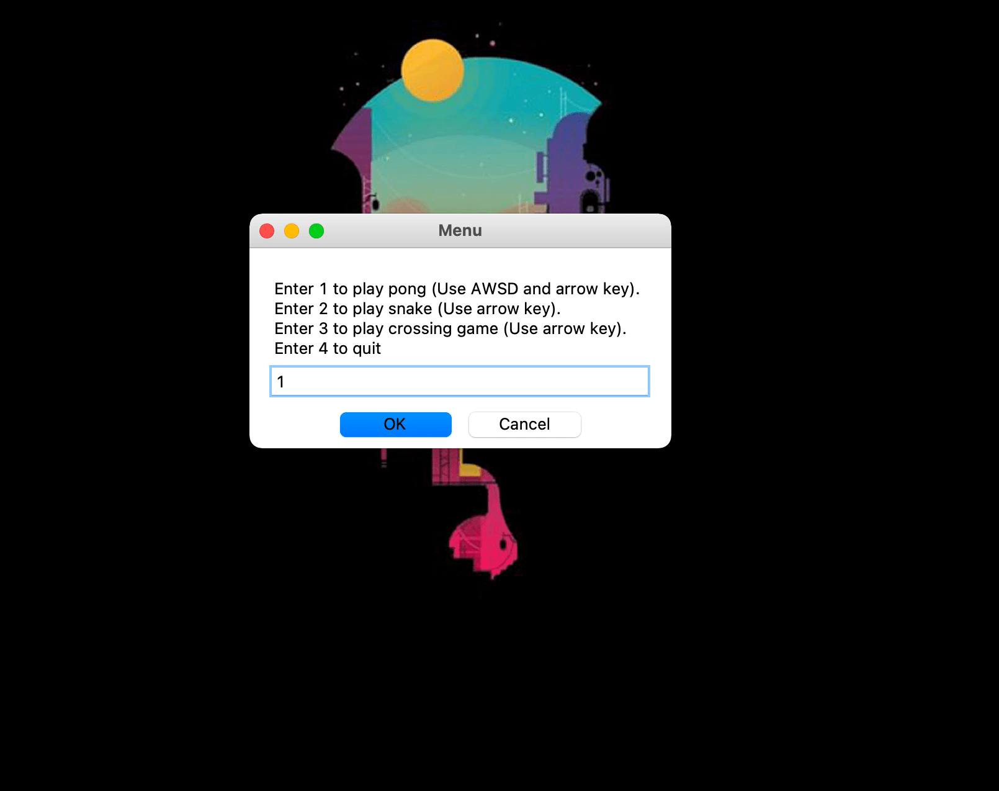

# arcade-games

## What is this?
A fun arcade game that lets you play ping-pong, snake, and crossing road. This game is built with Object-oriented programming paradigm to make code more reusable and clearer to see.

#### Ping-Pong Game
A 2-player game that can be played with AWSD and arrow key. The ball will gets faster each time it bounces to player's paddle. First player to reach 11 wins.

#### Snake Game
The legendary snake game built in python. The snake body is programmed like a linked-list (though it is implemented with array). Use the arrow key and get the rainbow food in order to grow bigger. Highscore is stored locally in txt file to make sure it is not resetted each time the program starts.

#### Crossing Road Game
The famous mobile crossing road game is now ready in python. Though it looks way simpler, it has the same core functionality. Use the arrow key to go to the other end of the road to make it to the next level, you can also take a break in the middle river as there is no car there.

## How to run the game?
- Download all the files (You can download in zip)
- Have any Python 3.xx installed
- Run the main files (python main.py in terminal

## Acknowledgement
[Angela Yu's 100 Days of Python Course](https://www.udemy.com/course/100-days-of-code/)
